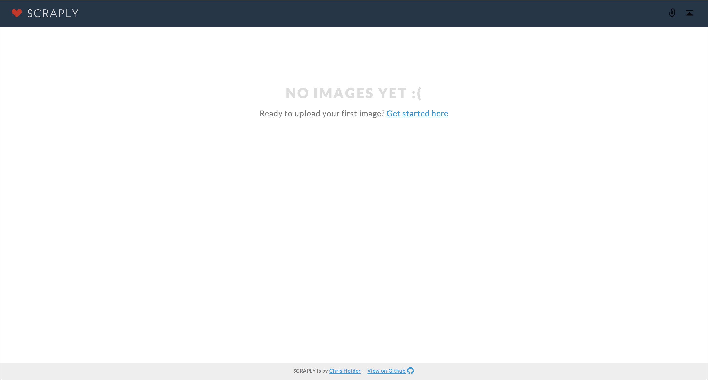

Scraply
================

A personal image bookmark gallery built on Wordpress. <a href="http://scraply.see8ch.com" target="_blank">View Demo</a>.

<h1>Installation</h1>

<h3>Local</h3>
Scraply works great as a private local library.
<ul>
	<li>Create a local database and install <a href="http://wordpress.org/download/" target="_blank">WordPress</a></li>
	<li>Navigate to your directory (ex: <code>scraply:8888/</code>) and run the WordPress install</li>
	<li>Upload the <code>sparkly</code> theme to <code>wp-content/themes/</code> and activate the theme.</li>
	<li>Navigate to <code>Settings > Media</code> through the admin panel and set the thumbnail size to 600px by 600px and uncheck 'Crop Thumbnail...'.</li>
</ul>

<h3>Hosted</h3>
Scraply also works as a hosted library.
<ul>
	<li>Scraply works best when installed in a subdomain (ex: <code>scraply.yourdomain.com/</code>)</li>
	<li>Create a database and install <a href="http://wordpress.org/download/" target="_blank">WordPress</a> or use your hosting company's application manager</li>
	<li>Navigate to your directory and run the WordPress install</li>
	<li>Upload the <code>sparkly</code> theme to <code>wp-content/themes/</code> and activate the theme.</li>
	<li>Navigate to <code>Settings > Media</code> through the admin panel and set the thumbnail size to 600px by 600px and uncheck 'Crop Thumbnail...'.</li>
</ul>

After a successful installation, your site should look like this:

<h1>Adding Images</h1>
<ul>
	<li>Click on the 'add' button, 'Get Started Here' link or navigate to <code>Media > Add New</code> on the admin panel to upload images into the Media Library</li>
	
	<li>Refresh or Navigate to the root directory to see changes.</li>
</ul>

<h3>Planned Future Updates</h3>
<ul>
	<li>Add media via URL</li>
	<li>Image meta data</li>
	<li>Share to social networks</li>
	<li>Lightbox</li>
	<li>Tag and Category filters</li>
</ul>

<h3>Contribute</h3>

If you think you can make this better, please Download, Fork, & Commit. We'd love to see your ideas.

Scraply is built on WordPress with Automattic's <a href="http://underscores.me/">Underscores</a> theme template.